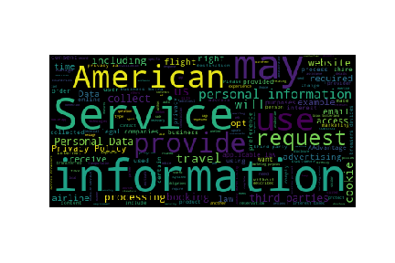

This repo contains the data and code used for our research paper: "[The Market for Data Privacy](https://www.ssrn.com/abstract=3352175)" by Tarun Ramadorai, Antoine Uettwiller and Ansgar Walther (Imperial College London). 
The easiest way to see the structure of our data and Python code is to look at 
the Jupyter notebooks `demoData.ipynb` and `demoCode.ipynb`. 

If you use these resources in your own work, please cite our paper (bibtex below).

We welcome any suggestions on how to improve our approach! You can contact us at: a.walther@imperial.ac.uk

## Data
1. `data/attributes.csv` contains the privacy attributes of all US firms in our sample: Whether we found a privacy policy (*found*), whether this policy is visible (*visible*), its length (*paragraphs, words*), its Fog readability (*fog*), the overall legal clarity index (*overall*), and the number of third-party tracking cookies on its website (*tptrackingcookies*). All variables are defined in the oaoer. The data has identifiers `gvkey` that can be used to merge it with Compustat data, as well as `weburl` identifiers for the website of each firm. 
2. `data/policies.json` contains the full text of all privacy policies we found in this sample is in . Each policy is saved as a list of paragraphs. This data has `weburl` identifiers.
3. `data/expert.csv` contains the evaluations of a legal expert for a smaller sample of policies are in . This data has 
Details of expert's criteria are in the paper.
These evaluations form the basis of our legal clarity index. This data has `weburl` identifiers.

## Python Modules
1. `src/urls.py` contains tools that find candidate URLs for privacy policies on a given website.
2. `src/text.py` contains tools that download privacy policies (given candidate URLs) and cleans them for natural language processing. 
3. `src/attributes.py` contains tools that calculate the attributes of privacy policies (visibility, length, readability, legal clarity) as used in the paper.

(these modules call on `src/utils.py` which contains various auxiliary functions)

**Note** Our paper and the published data also contain measures of third-party tracking activity. 
We obtained these data manually by uploading lists of websites to www.privacyscore.org, 
which in turn uses the OpenWPM software developed by Englehardt and Narayanan (see https://github.com/mozilla/OpenWPM). 

We are working on a simple, end-to-end module that automates this process. Please contact us if you are interested.

## Simplest Example
Here are 5 lines of code that find the policy for American Airlines:

```
from src.urls import crawlPrivacy, filterPrivacy
from src.text import findPolicy
status, urls = crawlPrivacy('www.aa.com',clicks=2) # crawls candidate URLs
ranked = filterPrivacy(sum(urls,[])) # filter and rank by likelihood of being privacy policy
status, policy, url = findPolicy(ranked) # scrape highest ranked page that contains 'privacy'
```

Using this information, we can produce a word cloud for AA's privacy policy:
``` 
from wordcloud import WordCloud
import matplotlib.pyplot as plt
wc = WordCloud()
wc.generate(' '.join(policy))
plt.imshow(wc); plt.axis('off')
```




## Citation

```
@article{ramadorai2019market,
  title={The Market for Data Privacy},
  author={Ramadorai, Tarun and Walther, Ansgar and Uettwiller, Antoine},
  year={2019},
  publisher={CEPR Discussion Paper No. DP13588}
}
```
